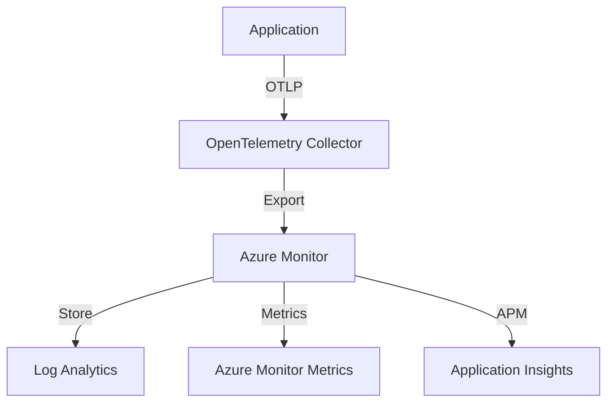

# Comprehensive Monitoring with Azure Monitor and OpenTelemetry

## 1. Azure Monitor Integration

### Setup Azure Monitor
```batch
@REM Enable Azure Monitor add-on
az aks enable-addons ^
    --resource-group myResourceGroup ^
    --name myAKSCluster ^
    --addons monitoring

@REM Create Log Analytics workspace
az monitor log-analytics workspace create ^
    --resource-group myResourceGroup ^
    --workspace-name myAKSWorkspace

@REM Configure AKS with Log Analytics
az aks update ^
    --resource-group myResourceGroup ^
    --name myAKSCluster ^
    --enable-managed-identity ^
    --workspace-resource-id <workspace-id>
```

### Monitoring Components
1. Container Insights
2. Log Analytics
3. Application Insights
4. Azure Monitor Metrics

## 2. OpenTelemetry Integration

### Components
1. OpenTelemetry Collector
2. Auto-instrumentation
3. Custom instrumentation
4. Exporters

### Setup Example
```yaml
apiVersion: opentelemetry.io/v1alpha1
kind: OpenTelemetryCollector
metadata:
  name: otel-collector
spec:
  config: |
    receivers:
      otlp:
        protocols:
          grpc:
            endpoint: "0.0.0.0:4317"
          http:
            endpoint: "0.0.0.0:4318"
      
    processors:
      batch:
        timeout: 1s
        send_batch_size: 1024
      
    exporters:
      azuremonitor:
        instrumentation_key: ${APPINSIGHTS_KEY}
      
    service:
      pipelines:
        traces:
          receivers: [otlp]
          processors: [batch]
          exporters: [azuremonitor]
        metrics:
          receivers: [otlp]
          processors: [batch]
          exporters: [azuremonitor]
```

## 3. Integration Architecture

### Data Flow
1. Application instrumentation
2. Data collection
3. Processing
4. Storage
5. Visualization

### Components Interaction


## 4. Implementation Guide

### 1. Setup Azure Resources
```batch
@REM Create Application Insights
az monitor app-insights component create ^
    --app myApp ^
    --location eastus ^
    --resource-group myResourceGroup

@REM Get instrumentation key
az monitor app-insights component show ^
    --app myApp ^
    --resource-group myResourceGroup ^
    --query instrumentationKey
```

### 2. Deploy OpenTelemetry Collector
```batch
@REM Install OpenTelemetry Operator
kubectl apply -f https://github.com/open-telemetry/opentelemetry-operator/releases/latest/download/opentelemetry-operator.yaml

@REM Create collector instance
kubectl apply -f otel-collector.yaml
```

### 3. Configure Applications
```yaml
# Example application deployment with auto-instrumentation
apiVersion: apps/v1
kind: Deployment
metadata:
  name: sample-app
spec:
  template:
    metadata:
      annotations:
        instrumentation.opentelemetry.io/inject-sdk: "true"
    spec:
      containers:
      - name: app
        image: sample-app:latest
        env:
        - name: OTEL_EXPORTER_OTLP_ENDPOINT
          value: "http://otel-collector:4318"
```

## 5. Best Practices

### Monitoring
1. Set up proper retention policies
2. Configure meaningful metrics
3. Create relevant dashboards
4. Implement alerting

### Telemetry
1. Use proper sampling
2. Implement structured logging
3. Add relevant context
4. Monitor collector performance

### Security
1. Secure endpoints
2. Manage access control
3. Protect sensitive data
4. Regular updates

## 6. Troubleshooting

### Common Issues
1. Data collection issues
2. Performance problems
3. Configuration errors
4. Integration failures

### Resolution Steps
1. Check collector logs
2. Verify configurations
3. Test connectivity
4. Monitor resource usage
